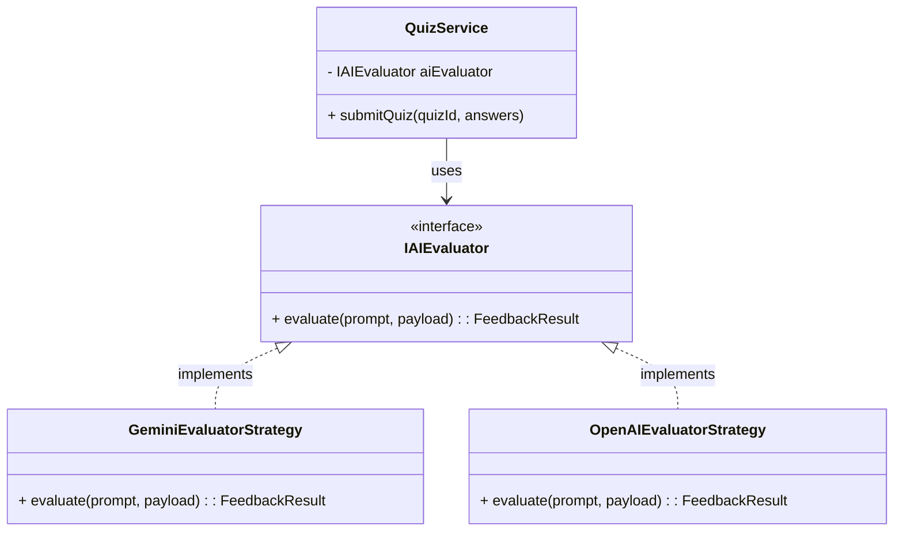
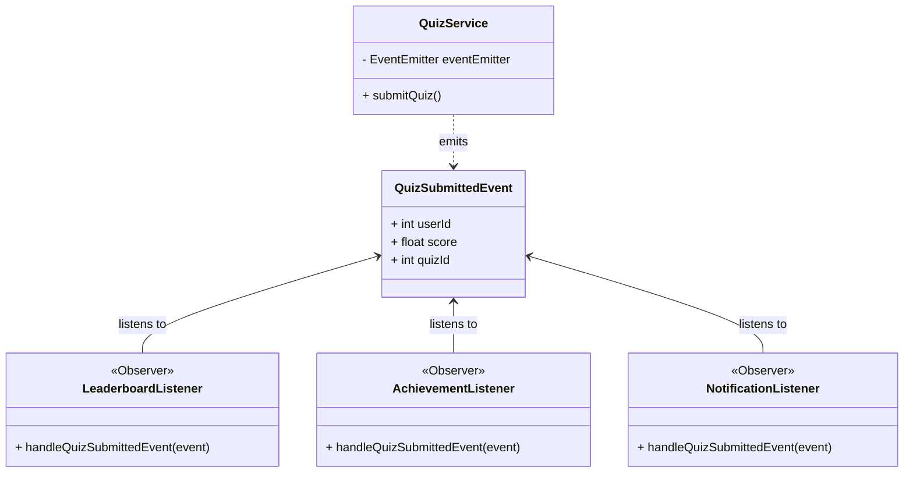

# Biểu đồ Lớp (Class Diagram) - Các Design Pattern Tiêu Biểu

> Trong hệ thống KLTN Breadtrans, chúng tôi áp dụng các Design Pattern chuẩn mực (như **Strategy Pattern** và **Observer Pattern**) để giải quyết các luồng nghiệp vụ phức tạp.

## 1. Mẫu Chiến lược (Strategy Pattern) - AI Evaluator
> Dùng để thiết kế module chấm bài AI. Cho phép thay đổi linh hoạt giữa các AI Provider (Google Gemini, OpenAI, Claude) mà không làm hỏng code hệ thống.

---

## 2. Mẫu Quan sát (Observer Pattern) - Event-Driven Gamification
> Khi người dùng nộp bài (Quiz) thành công, hệ thống không gọi hàm cộng điểm trực tiếp (tránh thắt cổ chai - tightly coupled), mà thay vào đó sẽ **Phát ra một Sự kiện (Event)**. Các Listener (Observer) sẽ chực chờ sự kiện này để xử lý logic riêng biệt (Cộng điểm, Tặng huy hiệu, Thông báo).

